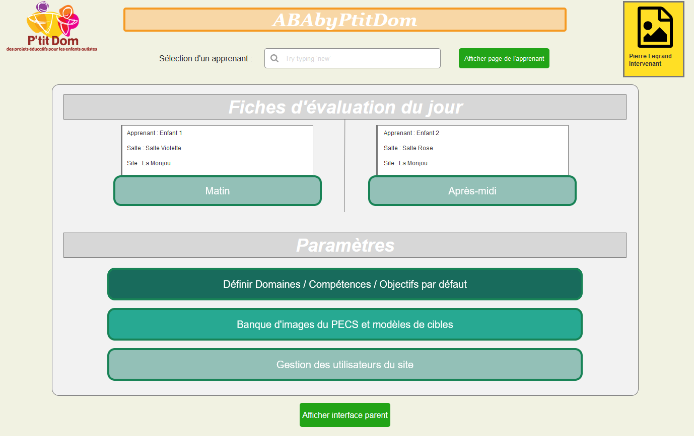
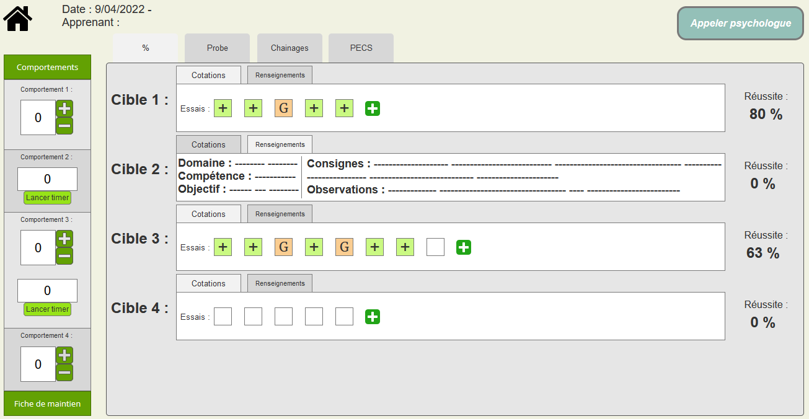
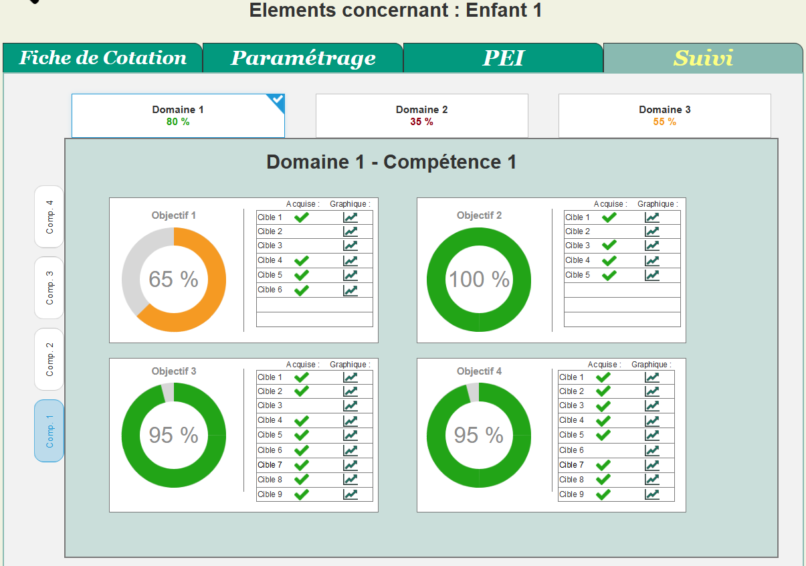

# Prototype

Maquette du site web ABAbyPtitDom en cours de développement (disponible [ici](https://p-tit-dom.github.io/Prototype/))

## Prérequis

- Axure RP 10 (free trial de 30 jours, possibilité de demander une version étudiante gratuitement) :
*<https://www.axure.com/blog/category/axure-rp-10>*
- Un navigateur web quelconque pour ouvrir la maquette buildée (au format html)

## Fonctionnement global

Axure est un logiciel de créations de maquettes interactives pour la création de sites web ou de logiciels. Il met à disposition une librairie de widgets (boutons, listes, zones de texte...) et de formes géométriques que l'on peut disposer librement sur des pages formatées selon le type d'appareil auquel la maquette est destinée.
Pour cela glisser-déposer l'élément à ajouter de la librairie vers la page en cours d'édition :

|Ajouter des widgets à la page|Gérer les intéractions entre widgets et la mise en page|
|:----------------------------|:------------------------------------------------------|
| |  |

Les interactions entre widgets permettent de faire le lien entre les pages.

L'outil `dynamic panel` permet de gérer le widget à afficher selon certaines conditions que l'on peut établir sur un autre widget. (ex: afficher différentes listes à un même endroit selon l'option sélectionnée sur un menu déroulant)

L'outil `repeater` permet d'afficher des modèles répétitifs de widgets que l'on va insérer dans un tableur, de manière à ce que l'utilisateur puisse saisir des données sans que l'on connaisse à l'avance le nombre de lignes nécessaires.

Lien vers une liste de tutoriels fournit par Axure permettant une bonne prise en main de l'outil :

*documentation sur le fonctionnement d'Axure :*
*<https://docs.axure.com/axure-rp/reference/getting-started-video/>*

*tutoriels pour créer ses premières interactions entre widgets :*
*<https://docs.axure.com/axure-rp/tutorials/interactive-button/>*

## Visualisation de la maquette

- Option 1 : Ouvrir la [Github Page](https://p-tit-dom.github.io/Prototype/) associée qui se met à jour à chaque commit.
- Option 2 : Ouvrir le fichier `page_de_connexion.html` ou "accueil.html" dans le dossier `Site` contenant la maquette exportée  
*nb : le fichier index.html n'est ouvrable que sur chrome avec l'extension Axure déjà installée*
- Option 3 : Ouvrir le fichier `Maquette.rp` puis appuyer sur le bouton **Preview** en haut à droite (bouton play) qui va ouvrir le site sur navigateur.

## Renseignements sur la maquette

### `Page de connexion :`

Premier écran à afficher, elle permettra d'identifier le rôle de la personne connectée. Les pages accessibles à l'utilisateur variant selon le rôle de celui-ci (*Psychologue, intervenante, parents ...*) tout utilisateur voulant se connecter au site devra au préalable avoir un compte (*potentiellement prévoir une manière de demander la création d'un compte pour la première connexion d'un intervenant ou d'un parent sur le site*)

### `Accueil :`

Page d'accueil du site, toutes les options ne seront donc pas accessibles à tous selon le rôle de l'utilisateur :

• **Page du PEI**, accessible aux psychologues et aux parents mais l'interface à afficher est différente, les psychologues auront accès à la page de création du PEI tandis que les parents auront accès à une interface de validation.  
• **Evaluation journalière de l'enfant**, accessible aux psychologues et intervenants pour permettre la modification en cas d'erreur de saisie (*certains intervenants en formation peuvent considérer acquis une cible qui est en fait guidée*)  
• **Suvi de l'enfant**, accessible aux psychologues uniquement.  
• **Création des fiches de cotation**, accessible aux psychologues et aux intervenants, même interface pour les deux.  
• **Bilan de l'activité**, accessible aux professionnels partenaires et membres de l'association.

### `Création du PEI :`

Page de création du Programme Éducatif Individualisé soit la liste des Domaines/Compétences/Objectifs à aborder dans l'année pour un apprenant. Chaque domaine étant divisé en compétences lui étant associées et chaque compétence elle-même divisée en objectifs lui étant associés.  
La case `Constat` permet d'indiquer le niveau actuel de l'apprenant sur l'objectif fonctionne.  
La case `Priorité` d'indiquer l'ordre dans lequel traiter les objectifs.  
La case `Stratégie` d'indiquer la stratégie d'apprentissage de l'objectif.  
Bouton `historique des PEI` pour pouvoir consulter les PEI des années précédentes lors de la création d'un nouveau.  
Possibilité de faire des `avenants au PEI` en cours d'année qu'il faudra à un moment refaire valider aux parents.

 **Exemple** :  
**Domaine :** Communication et langage / **Compétence :** RA (Recherche d'attention) / **Objectif :** Interrompre son activité quand on l'appelle  
**Constat :** X à tendance à ignorer l'adulte quand elle est en train d'écouter de la musique / **Priorité :** Introduction immédiate / **Stratégie :** Dire son prénom quand elle est en train de jouer par exemple, elle devra arréter et tourner la tête pour vous regarder.

### `Création des fiches de cotation :`

Page de création des fiches de cotation pour l'évaluation journalière soit la liste des cibles à aborder dans une demi-journée pour un apprenant.  
La case `Type` permet de préciser le type de cotation :  
    • **%** Correspond à une cotation de la cible sur tous les essais de la journée, on récuperera le pourcentage d'essais réussis sur le nombre d'essais totaux.  
    • **Probe** correspond à la cotation du premier essai de la journée uniquement, le reste des essais sur la cible étant par défaut guidés pour renforcer la cible.  

La case `Historique` permet d'afficher les 3 dernières cotations sur la cible, une cible étant validée trois séances de suite étant considérée comme acquise.
La case `Observation` permet à la psychologue de donner des consignes plus précises sur la cible pour l'intervenant.  
La case `Remarque` permet d'indiquer le type d'environnement dans lequel la cible sera évaluée :  
    • **NET** = *Natural environment training*, situation d’apprentissage non-structurée, qui vise à créer des opportunités d’apprentissage en suivant les choix et la motivation de l’enfant.  
    • **ITT** = *intensive trial training*, apprentissage de manière systématique et intensive de compétences par l'utilisation d'un renforçateur positif.  
*Pour plus d'information cf. le lexique dans le README du cahier des charges*

|Onglet Classeur PECS|Onglet Fiche de maintien|
|:----------------------------|:------------------------------------------------------|
| |  |

Le classeur PECS correspond aux Pictos déjà connus et utilisés par l'apprenant, ils sont renseignés afin de faciliter la cotation de l'intervenant lors des séances de PECS.  
La fiche de maintien correspond aux cibles qu'il faudra ré-évaluer une fois par semaine pour éviter à l'apprenant d'oublier l'acquis.  
***nb : une case à cocher est présente directement dans la fiche de cotation pour ajouter une cible à la fiche de maintien lorsqu'elle sera acquise***

### `Évaluation journalière :` (Screen temporaire, modifications à effectuer)

|Eval journalière (fiche de cotation à remplir)|Onglet Fiche de maintien|
|:----------------------------|:------------------------------------------------------|
| |  |

Interface sur tablette destinée aux intervenants, chaque case de cotation a 3 états possibles différents :  
**`+`** - dans le cas où la cible/étape à été correctement effectuée spontanément par l'apprenant  
**`G`** - dans le cas où l'intervenant a dû guider l'apprenant pour qu'il effectue correctement la cible  
et une case vide pour une cotation qui n'a pas encore été effectuée.  
*À noter qu'une cotation doit pouvoir être modifiable à tout moment (même une fois validée) pour pouvoir ajouter des essais ou changer une cotation considérée comme validée alors qu'elle serait en fait guidée après concertation avec la psychologue.*

Onglet déroulant servant à noter le travail effectué en phase de PECS :

  
|  

### `Suivi de la progression :`

    

Page de suivi de la progression d'un apprenant, permet de suivre la complétion du PEI par Domaines/Compétences/Objectifs. Un graphe serait aussi générable pour chaque cible afin de voir la vitesse de progression et si l'acquis a déjà été perdu au cours de l'année. De plus un résumé de l'évolution des troubles du comportement et de la dernière demi-journée seraient disponibles sur cette page :

|Résumé dernière demi-journée|Interface montrant l'évolution des troubles du comportement|
|:----------------------------|:------------------------------------------------------|
| |  |
La page de résumé de la dernière demi-journée permet d'avoir un aperçu, (potentiellement affichable aux parents) de ce qui a été effectué dans la dernière séance par l'apprenant.| La page de suivi des troubles du comportement permet de suivre l'évolution et la tendance d'un trouble en particulier, de plus elle permettrait de réintroduire un comportement qui referait surface et de conserver une trace du travail effectué.
