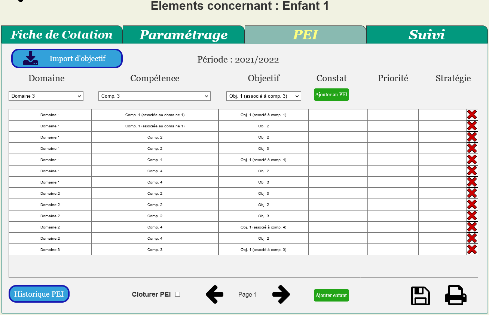
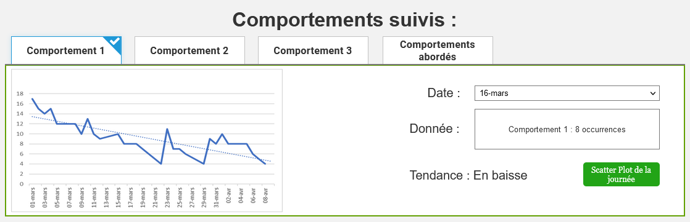
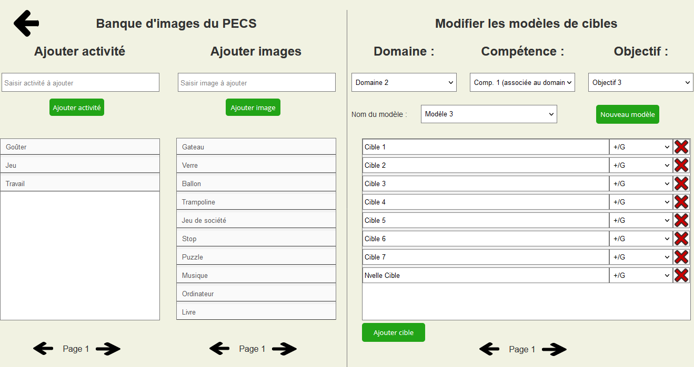

# Prototype

Maquette de l'application web ABAbyPtitDom en cours de développement (disponible [ici](https://p-tit-dom.github.io/Prototype/))

## Prérequis

- Axure RP 10 (free trial de 30 jours, possibilité de demander une version étudiante gratuitement) :
*<https://www.axure.com/blog/category/axure-rp-10>*
- Un navigateur web quelconque pour ouvrir la maquette buildée (au format html)

## Fonctionnement global

Axure est un logiciel de créations de maquettes interactives pour la création de sites web ou de logiciels. Il met à disposition une librairie de widgets (boutons, listes, zones de texte...) et de formes géométriques que l'on peut disposer librement sur des pages formatées selon le type d'appareil auquel la maquette est destinée.
Pour cela glisser-déposer l'élément à ajouter de la librairie vers la page en cours d'édition :

|Ajouter des widgets à la page|Gérer les intéractions entre widgets et la mise en page|
|:----------------------------|:------------------------------------------------------|
| |  |

Les interactions entre widgets permettent de faire le lien entre les pages.

L'outil `dynamic panel` permet de gérer le widget à afficher selon certaines conditions que l'on peut établir sur un autre widget. (ex: afficher différentes listes à un même endroit selon l'option sélectionnée sur un menu déroulant)

L'outil `repeater` permet d'afficher des modèles répétitifs de widgets que l'on va insérer dans un tableur, de manière à ce que l'utilisateur puisse saisir des données sans que l'on connaisse à l'avance le nombre de lignes nécessaires.

Lien vers une liste de tutoriels fournit par Axure permettant une bonne prise en main de l'outil :

*documentation sur le fonctionnement d'Axure :*
*<https://docs.axure.com/axure-rp/reference/getting-started-video/>*

*tutoriels pour créer ses premières interactions entre widgets :*
*<https://docs.axure.com/axure-rp/tutorials/interactive-button/>*

## Visualisation de la maquette

- Option 1 : Ouvrir la [Github Page](https://p-tit-dom.github.io/Prototype/) associée qui se met à jour à chaque commit.
- Option 2 : Ouvrir le fichier `page_de_connexion.html` ou "accueil.html" dans le dossier `Site` contenant la maquette exportée  
*nb : le fichier index.html n'est ouvrable que sur chrome avec l'extension Axure déjà installée*
- Option 3 : Ouvrir le fichier `Maquette.rp` puis appuyer sur le bouton **Preview** en haut à droite (bouton play) qui va ouvrir l'application sur navigateur.

## Renseignements sur la maquette

### `Page de connexion :`

Premier écran à afficher, elle permettra d'identifier le rôle de la personne connectée. Les pages accessibles à l'utilisateur variant selon le rôle de celui-ci (*Psychologue, intervenante, parents ...*) tout utilisateur voulant se connecter à l'application devra au préalable avoir un compte (*potentiellement prévoir une manière de demander la création d'un compte pour la première connexion d'un intervenant ou d'un parent sur l'application*)

### `Accueil :`

Page d'accueil de l'application, toutes les options ne seront donc pas accessibles à tous selon le rôle de l'utilisateur :

• **Champ de recherche vers la page de l'apprenant**, accessible à tout moment en haut des pages principales, renvoie vers la page contenant le paramétrage et toutes les informations relatives à un enfant  
• **Fiches d'évaluation du jour**, pour intervenants et psychologues, affichage des séances qui doivent avoir lieu dans la journée directement depuis la page d'accueil pour gagner du temps dans les cotations quotidiennes  
• **Parmétres**, paramétrage propre à l'application web, accessible uniquement aux psychologues pour établir les différents domaines/compétences/objectifs (pas cible car associées à un enfant, sur la page de l'apprenant), la base de donnée correspondant aux images du PECS, les modèles de cibles et gérer les différents utilisateurs du suite  
• **Afficher interface parent**, affiche l'écran d'accueil pour un parent, bouton n'existant pas sur la version finale de l'application.

### `Page de l'apprenant, édition des fiches de cotation :`

Menu de création des fiches de cotation pour l'évaluation journalière soit la liste des cibles à aborder dans une demi-journée pour un apprenant.  
La case `Type` permet de préciser le type de cotation :  
    • **%** Correspond à une cotation de la cible sur tous les essais de la journée, on récuperera le pourcentage d'essais réussis sur le nombre d'essais totaux.  
    • **Probe** correspond à la cotation du premier essai de la journée uniquement, le reste des essais sur la cible étant par défaut guidés pour renforcer la cible.  

La case `Historique` permet d'afficher les 3 dernières cotations sur la cible, une cible étant validée trois séances de suite étant considérée comme acquise.
La case `Observation` permet à la psychologue de donner des consignes plus précises sur la cible pour l'intervenant.  
La case `Remarque` permet d'indiquer le type d'environnement dans lequel la cible sera évaluée :  
    • **NET** = *Natural environment training*, situation d’apprentissage non-structurée, qui vise à créer des opportunités d’apprentissage en suivant les choix et la motivation de l’enfant.  
    • **ITT** = *intensive trial training*, apprentissage de manière systématique et intensive de compétences par l'utilisation d'un renforçateur positif.  
*Pour plus d'information cf. le lexique dans le README du cahier des charges*

Bouton lancer la séance en cas de bug de la page d'accueil ou d'absence d'une intervenante, il faut quand même pouvoir coter les cibles de la journée.  

En dessous la liste des cibles acquises dans la fiche de maintien avec possibilité d'en ajouter/retirer. Ces cibles devront être cotées une fois par semaine pour éviter la perte d'acquis.
  
***nb : une case à cocher est présente directement dans la fiche de cotation pour ajouter une cible à la fiche de maintien lorsqu'elle sera acquise***

### `Page de l'apprenant, historique des fiches de cotation :`

Menu de consultation des cotations des séances précédentes, permet de garder un historique complet de la progression d'un enfant, classée par type d'activité.

### `Création du Programme Éducatif Individualisé (PEI) :`

Page de création du PEI soit la liste des Domaines/Compétences/Objectifs à aborder dans l'année pour un apprenant. Chaque domaine étant divisé en compétences lui étant associées et chaque compétence elle-même divisée en objectifs lui étant associés.  
La case `Constat` permet d'indiquer le niveau actuel de l'apprenant sur l'objectif fonctionne.  
La case `Priorité` d'indiquer l'ordre dans lequel traiter les objectifs.  
La case `Stratégie` d'indiquer la stratégie d'apprentissage de l'objectif.  
Bouton `historique des PEI` pour pouvoir consulter les PEI des années précédentes lors de la création d'un nouveau.  
Possibilité de faire des `avenants au PEI` en cours d'année qu'il faudra à un moment refaire valider aux parents.

 **Exemple** :  
**Domaine :** Communication et langage / **Compétence :** RA (Recherche d'attention) / **Objectif :** Interrompre son activité quand on l'appelle  
**Constat :** X à tendance à ignorer l'adulte quand elle est en train d'écouter de la musique / **Priorité :** Introduction immédiate / **Stratégie :** Dire son prénom quand elle est en train de jouer par exemple, elle devra arréter et tourner la tête pour vous regarder.

Ajout d'un bouton permettant d'importer directement des objectifs depuis le PEI d'un autre enfant pour faciliter la saisie.

### `Suivi de la progression :`

Page de suivi de la progression d'un apprenant, permet de suivre la complétion du PEI par Domaines/Compétences/Objectifs. Un graphe serait aussi générable pour chaque cible afin de voir la vitesse de progression et si l'acquis a déjà été perdu au cours de l'année. De plus un résumé de l'évolution des troubles du comportement et de la dernière demi-journée seraient disponibles sur cette page :

|Interface montrant l'évolution des troubles du comportement|Scatter Plot|
|:----------------------------|:------------------------------------------------------|
|  La page de suivi des troubles du comportement permet de suivre l'évolution et la tendance d'un trouble en particulier pour un jour donné, à travers un historique et un graphe de suivi. De plus elle permettrait de réintroduire un comportement qui referait surface et de conserver une trace du travail effectué.|   Elle propose également des *scatter plot* pour chaque semaine afin de suivre plus précisément l'apparition des troubles et de potentiellement en identifier les déclencheurs.|

### `Évaluation journalière :`

|Eval journalière (fiche de cotation à remplir)|Onglet Fiche de maintien|
|:----------------------------|:------------------------------------------------------|
| |  |

Interface sur tablette destinée aux intervenants, chaque case de cotation a 3 états possibles différents :  
**`+`** - dans le cas où la cible/étape à été correctement effectuée spontanément par l'apprenant  
**`G`** - dans le cas où l'intervenant a dû guider l'apprenant pour qu'il effectue correctement la cible  
et une case vide pour une cotation qui n'a pas encore été effectuée.  
*À noter qu'une cotation doit pouvoir être modifiable à tout moment (même une fois validée) pour pouvoir ajouter des essais ou changer une cotation considérée comme validée alors qu'elle était en fait guidée après concertation avec la psychologue.*

### `Accueil Parent :`

Les parents auraient donc accès à **l'historique des fiches de cotation**, la **consultation du PEI** et le **suivi de progression** de leur enfant.
Petit ajout cependant, dans la consultation du PEI une icone de notification s'affiche sur l'onglet en cas *d'avenant au PEI*, càd dans le cas où le PEI serait modifié en cours de cycle. Il faudrait alors une validation par les parents du nouveau PEI, validation qui pourrait se faire en ligne pour de petites modifications, contrairement à la toute première validation du PEI qui doit se faire en personne par demande des psychologues.

## `Pages de Paramétrage de l'application :`

### `Paramétrage des domaines/compétences/objectifs :`

Menu de paramétrage, permet d'ajouter et modifier des domaines/compétences/objectifs à la base de donnée. Chaque élément des listes est cliquable pour sélectionner le chemin d'accés à l'objectif/la compétence.  
Par exemple pour afficher dans la liste du milieu les compétences associées au domaine 2, il suffit de cliquer sur domaine 2 dans la liste de gauche. Ensuite il suffit de saisir le nom de la compétence que l'on veut ajouter.

### `Paramétrage de la banque d'images PECS et des modèles de cibles :`

  
Menu de paramétrage gérant deux banques de données à la fois.

- Gestion de la banque d'images PECS, permet de répertorier tous les pictogrammes PECS existants et d'en ajouter au besoin. Permet de faciliter la cotation des phases de PECS sans avoir à saisir le nom de l'image à chaque demande.

- Gestion des modèles de cibles pour chaque objectif, permet de créer des modèles standards de cibles personnalisées pour faciliter la saisie des cibles à la création du PEI. Option très pratique notamment pour la saisie de chainages, ceux-ci variant légèrement d'un enfant à l'autre, on pourra par exemple créer un modèle correspondant au brossage de dents à la brosse à dents électrique et un autre au brossage à la brosse à dents classique.

### `Gestion des utilisateurs du site :`

Menu de gestion des utilisateurs, nécessaire pour retirer l'accès à l'application aux intervenants à la fin de leur service civique et ajouter les nouveaux. Devra aussi permettre à terme la gestion des parents et l'attribution d'un profil parent à un enfant (ou plus au cas où).

### `Paramétrage des données sur l'enfant, sur la page de l'apprenant :`

Menu de gestion des des cibles personnalisées et du classeur PECS propres à l'enfant. On peut donc appliquer les modèles de cibles vus plus tôts, en enregistrer un nouveau dans le cas où la liste ne correspond pas déjà à un modèle connu et en ajouter/retirer aux modèles pré-existants pour ajuster plus précisément aux besoins de l'enfant. Ce menu permet aussi de paramétrer pour chaque cible les critères d'acquisition et de révision, de manière à ce qu'une cible validant le critère d'acquisition soit automatiquement considérée comme validée, et une cible suivant le critère de révision soit automatiquement remise dans la liste des cibles à acquérir.

L'onglet de gestion du classeur PECS permet de répertorier les pictos déjà connus et utilisés par l'enfant de manière à réduire la liste de pictos disponible dans la saisie de la fiche PECS.
